# 핸드오프 · 재밌는 감정 체크 (Emotion Check)

상담 회기 사이에 감정을 가볍게 기록하고, 감정 추이 그래프로 변화를 보여주는 안드로이드 앱의 **UI 디자인 시안 핸드오프 패키지**입니다.

---

## 시안 미리보기

| | | | |
|:-:|:-:|:-:|:-:|
| 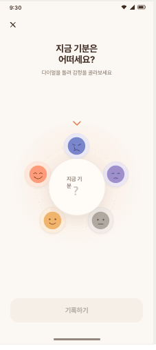 | 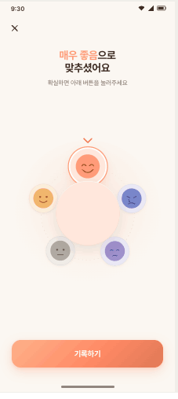 | 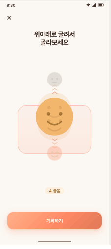 | 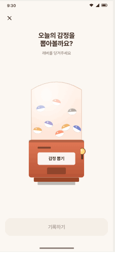 |
| 다이얼 · 선택 전 | 다이얼 · 선택 후 | 릴 · 모션 잔상 | 뽑기 · 뽑기 전 |
| 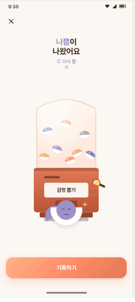 | 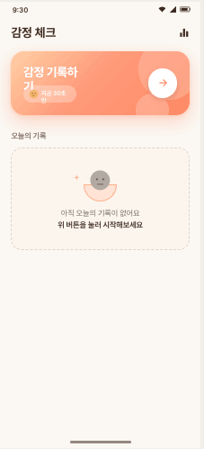 | 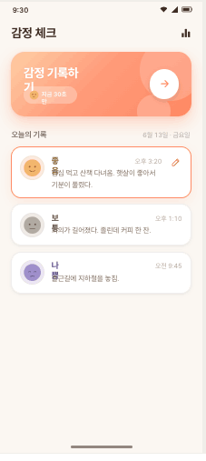 | 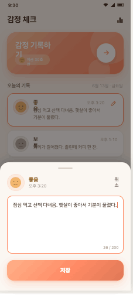 |
| 뽑기 · 결과 공개 | 홈 · 빈 상태 | 홈 · 기록 있음 | 홈 · 메모 편집 시트 |
| 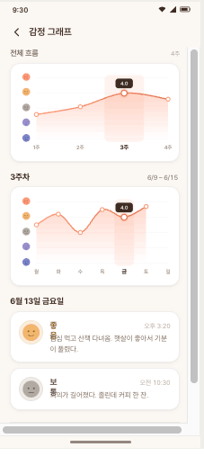 | 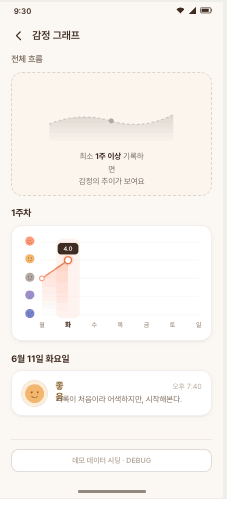 | 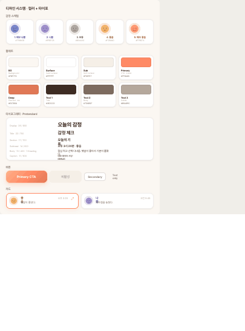 | |
| 그래프 · 정상 | 그래프 · 빈 상태 | 디자인 시스템 시트 | |

> 전체 캔버스(상호 비교용): `design/index.html`을 브라우저로 열기

---

## 0. 이 패키지 사용법 (Claude Code 에게)

**`design/` 폴더의 HTML/JSX 파일은 디자인 레퍼런스입니다 — production 코드가 아닙니다.**

- 디자인 시안은 React + Babel + 일반 CSS로 만들어진 **목업/프로토타입**입니다.
- 이 코드를 그대로 옮기지 말고, **타깃 안드로이드 프로젝트의 환경(예: Jetpack Compose + Material 3)에 맞춰 다시 구현**해주세요.
- 기존 안드로이드 프로젝트가 있다면 그 프로젝트의 패턴/네이밍/모듈 구조를 따르고, 없다면 **Jetpack Compose** 기반으로 시작하는 것을 권장합니다.
- 시안 확인 방법: `design/index.html`을 브라우저로 열면 모든 화면을 한눈에 비교할 수 있는 디자인 캔버스가 나옵니다.

**Fidelity**: **High-fidelity**. 컬러/타이포/간격/곡률은 시안과 픽셀 단위로 맞춰주세요. 다만 위젯의 모션은 시안에서 정지 상태로만 그려져 있으므로, 본문의 "마이크로 인터랙션" 섹션을 따라 구현해주세요.

---

## 1. 개요

- **앱 정체성**: 상담 회기 사이의 감정 기록을 **재미있고 가볍게**.
- **핵심 가치**:
  1. 낮은 기록 허들 — 5단계 얼굴 선택만으로 기록 완료
  2. 매번 다른 입력 위젯 — 다이얼/릴/뽑기 중 랜덤 1개
  3. 변화의 가시화 — 전체→주간→일별 그래프
- **플랫폼**: Android (안드로이드 폰 360 x 800 dp 기준; 1080 x 2400 px @ 3x)
- **언어**: 한국어 (UI 카피 한국어)
- **다크 모드**: 이번 라운드 미포함 (라이트 only). 추후 추가 가능하도록 토큰 분리 권장.

---

## 2. 화면 인벤토리

총 **3개 화면** × 다중 상태 = **10개 시안 artboard** + 디자인 시스템 시트 1개.

| ID                | Screen           | State                                     |
| ----------------- | ---------------- | ----------------------------------------- |
| `record-dial-A`   | RecordScreen     | 다이얼 위젯 · 선택 전                     |
| `record-dial-B`   | RecordScreen     | 다이얼 위젯 · 선택 후 (level 5 매우 좋음) |
| `record-reel`     | RecordScreen     | 릴 위젯 · 모션 잔상 (level 4 좋음)        |
| `record-gacha-A`  | RecordScreen     | 뽑기 위젯 · 뽑기 전                       |
| `record-gacha-B`  | RecordScreen     | 뽑기 위젯 · 결과 공개 (level 2 나쁨)      |
| `home-empty`      | HomeScreen       | 빈 상태 (오늘 기록 없음)                  |
| `home-filled`    | HomeScreen       | 기록 있음 (최신 1 + 이전 2)               |
| `home-sheet`      | HomeScreen       | 메모 편집 바텀시트 열림                   |
| `graph-normal`    | GraphScreen      | 정상 (4주 데이터, 3주차/금 선택)          |
| `graph-empty`     | GraphScreen      | 빈 상태 (1주차만)                         |
| `design-system`   | —                | 컬러/타이포/컴포넌트 레퍼런스             |

---

## 3. 디자인 토큰

### 3.1 컬러

```kotlin
object EmotionColors {
    // Surfaces
    val Bg          = Color(0xFFFBF7F2)  // 앱 배경 (크림)
    val BgWarm      = Color(0xFFF8F1E8)
    val Surface     = Color(0xFFFFFFFF)  // 카드 표면
    val SurfaceSub  = Color(0xFFF5EFE7)  // 보조 표면
    val SurfaceSoft = Color(0xFFFBF5ED)  // 빈 상태 등

    // Text
    val Text1 = Color(0xFF3E2C23)  // 타이틀 (순흑 회피)
    val Text2 = Color(0xFF7D6B5F)  // 본문
    val Text3 = Color(0xFFB5A89C)  // 보조/캡션

    // Primary (코랄)
    val Primary     = Color(0xFFFF8A65)
    val PrimaryDeep = Color(0xFFE07856)
    val PrimarySoft = Color(0xFFFFE3D4)
    val PrimaryTint = Color(0x14FF8A65)  // 알파 8%

    // Lines
    val Line       = Color(0x14_3E2C23)  // 알파 8%
    val LineStrong = Color(0x29_3E2C23)  // 알파 16%
}

// 감정 5단계 — 채도 한 단계 낮춤
enum class EmotionLevel(
    val score: Int, val label: String,
    val color: Color, val tint: Color, val ink: Color
) {
    VeryBad (1, "매우 나쁨", Color(0xFF7986CB), Color(0xFFE8EAF6), Color(0xFF3D4783)),
    Bad     (2, "나쁨",     Color(0xFF9F8FCB), Color(0xFFEDE7F5), Color(0xFF574B85)),
    Neutral (3, "보통",     Color(0xFFB0AAA3), Color(0xFFEFECE8), Color(0xFF5C544B)),
    Good    (4, "좋음",     Color(0xFFF2B66D), Color(0xFFFCEFDC), Color(0xFF8C5E1F)),
    VeryGood(5, "매우 좋음", Color(0xFFFF9B7A), Color(0xFFFFE7DC), Color(0xFFA14A2A));
}
```

#### CTA 그라데이션

```
linear-gradient(135deg,
  #FFB28A 0%,
  #FF8A65 55%,
  #E07856 100%
)
```

#### 홈 큰 버튼 그라데이션

```
linear-gradient(135deg,
  #FFD0A6 0%,
  #FF9B7A 45%,
  #FF8A65 100%
)
```

Compose:
```kotlin
val ctaBrush = Brush.linearGradient(
    colorStops = arrayOf(
        0.00f to Color(0xFFFFB28A),
        0.55f to Color(0xFFFF8A65),
        1.00f to Color(0xFFE07856)
    ),
    start = Offset(0f, 0f),
    end   = Offset(1f, 1f) // 135deg 근사
)
```

#### 그래프 area 그라데이션

세로 그라데이션: top `rgba(255,138,101,0.32)` → bottom `rgba(255,138,101,0)`.

### 3.2 타이포그래피

**Font family**: `Pretendard` (한글/숫자 공용). 숫자 강조 시 `Inter` + tabular-nums 가능.

| Role     | Size | Weight    | Line height | Letter spacing |
| -------- | ---- | --------- | ----------- | -------------- |
| Display  | 26sp | 800       | 1.2         | -0.02em        |
| Title    | 22sp | 700       | 1.25        | -0.02em        |
| Section  | 17sp | 700       | 1.3         | -0.01em        |
| Subhead  | 14sp | 600       | 1.4         | -0.01em        |
| Body     | 13sp | 400       | 1.5         | -0.01em        |
| Caption  | 11sp | 500       | 1.4         | 0              |

> Pretendard 미설치 시 fallback: `"Apple SD Gothic Neo", system-ui, sans-serif`.

### 3.3 간격 / 둥근 모서리 / 그림자

- **Card radius**: 18dp (감정 기록 카드), 24dp (홈 큰 버튼 / 바텀시트 상단)
- **Button radius**: 18dp (Primary 56dp), 12dp (Ghost 40dp)
- **Page padding**: 좌우 20dp, 화면 별 상하 가변
- **Card padding**: 14–16dp
- **Card 간 gap**: 10dp

그림자 (warm shadow, 검정 30~40% 알파 + brown tint):
```
elevation 1: 0 1px 2px rgba(62,44,35,.04), 0 2px 8px rgba(62,44,35,.04)
elevation 2: 0 4px 12px rgba(62,44,35,.08), 0 1px 3px rgba(62,44,35,.05)
cta shadow:  0 8px 24px rgba(255,138,101,.28), 0 2px 6px rgba(224,120,86,.18)
```

---

## 4. 컴포넌트 명세

### 4.1 EmotionFace (5단계 얼굴)

`design/faces.jsx` 참고. 둥근 face + 단순 눈/입의 손그림 톤.

- **모양**: 100x100 viewBox 원 (`r=44`) + 표정.
- **색**: `EmotionLevel.color` 채움 + 톤다운된 외곽선 `rgba(0,0,0,0.06)`. 흑백/플랫 버전은 채움 없이 `ink` 색 stroke.
- **사이즈**:
  - 리스트 카드: 28~34dp (FaceChip 컨테이너 안)
  - 카드 메인: 44–60dp
  - 위젯 메인 (다이얼 토큰/릴 센터/뽑기 결과): 60–140dp
  - 그래프 y축: 18dp

표정 디테일 (level 1→5):

| Lv | 눈                       | 입                  | 부가                |
| -- | ------------------------ | ------------------- | ------------------- |
| 1  | 내려간 사선 (`\` `/`)    | 작은 frown          | 눈물방울 (좌측)     |
| 2  | 반쯤 감긴 호 (`⌐` `⌐`)  | 작은 frown          | —                   |
| 3  | 둥근 점 두 개            | 일자선              | —                   |
| 4  | 둥근 점 두 개            | 살짝 올라간 미소     | —                   |
| 5  | 위로 휜 초승달 (squint)  | 큰 미소             | 옵션: 볼터치 ellipse |

### 4.2 FaceChip

`EmotionLevel.tint` 배경의 원형 컨테이너 (1px `rgba(0,0,0,0.04)` 보더) + Face 78% 크기.

### 4.3 Primary CTA Button

- height 56dp, radius 18dp
- background: 위 CTA 그라데이션
- text: 16sp / 700, color #FFFFFF, letter-spacing -0.01em
- shadow: `cta shadow` (위)
- **Disabled**: 배경 `SurfaceSub`, 텍스트 `Text3`, shadow 없음
- **Pressed**: scale 0.985 (150ms)

### 4.4 Ghost Button / Text Button

- Ghost: height 40dp, radius 12dp, border 1px `LineStrong`, bg `Surface`, font 14sp/600 `Text2`.
- Text: 12–13sp/500 `Text2`.

### 4.5 Record Card (감정 기록 카드)

- bg `Surface`, radius 18dp, padding 14dp, border 1px `Line`, shadow elevation-1
- 가로 레이아웃: `FaceChip(44dp)` + 본문 + 우측 액션
- 본문 1행: 감정 라벨 (15sp/700, `EmotionLevel.ink`) + 시간 (12sp `Text3`, num)
- 본문 2행: 메모 (13sp/400 `Text2`, 2줄 ellipsis)
- **수정 가능 (`editable`) 모드**:
  - border 1.5px `Primary`
  - shadow `0 6px 20px rgba(255,138,101,.14)`
  - 우측에 연필 아이콘 (배경 없음, 18dp 크기, stroke 1.8 `PrimaryDeep`)

### 4.6 큰 감정 기록 버튼 (홈 상단)

- radius 24dp, padding 22/24dp
- 그라데이션 배경 + 우측 상단/우측 하단에 반투명 흰색 원 데코 (각 110dp, 60dp)
- 좌측: "감정 기록하기" 22sp/800 `#FFFFFF` + 작은 칩 (반투명 흰색 배경, Face L4 + "지금 30초만" 11sp/600 흰색)
- 우측: 52dp 원형 흰색 버튼 + 우측 화살표 SVG (stroke 2.4 Primary)
- **Pressed**: scale 0.985

### 4.7 Top App Bar

- height 52dp
- 좌측 아이콘 버튼 44x44 (배경 없음, 라운드 50%)
- 닫기(X): 22dp stroke 2 `Text1`
- 뒤로가기: 22dp `M15 5 L8 12 L15 19` stroke 2.2 `Text1`
- **그래프 진입 아이콘** (홈 우측): 22dp 막대 그래프 아이콘
  - bars at x=[4,10,16], width=4, y=[13,5,10], h=[8,16,11], radius 1.2, fill `Text1`

### 4.8 바텀시트 (메모 편집)

- 라운드 24dp top-only, bg `Bg`, shadow `0 -8px 24px rgba(0,0,0,.16)`
- handle: 40x4 radius 2 `rgba(62,44,35,.2)`
- 헤더: FaceChip(44) + 라벨/시간 + 우측 "취소" 텍스트 버튼
- TextField: bg `Surface`, radius 14dp, border 1.5px `Primary`, padding 14dp, min-height 130dp, 우측 하단에 글자수 `26 / 200` 11sp `Text3` (Inter num)
- **해시태그 칩 없음** (제거됨)
- Primary 버튼 56dp "저장"

### 4.9 Status Bar / Nav Bar

- 시안에는 보여주지만, 실제 안드로이드에서는 시스템 영역. 별도 구현 불필요.
- Edge-to-edge 적용 권장 (`WindowCompat.setDecorFitsSystemWindows(window, false)`), 시스템 바 색은 투명/light icons.

---

## 5. 입력 위젯 3종 상세

위젯은 RecordScreen 진입 시 **랜덤 1개** 표시. 모두 같은 톤·팔레트를 공유합니다.

### 5.1 돌림판 (Orbit Wheel)

**5개 감정이 점선 궤도 위에 원형으로 배치되고, 회전시켜 상단 indicator 위치의 감정을 선택**. 중앙에는 선택된 감정이 크게 미리보기로 노출됨 (선택 결과의 즉각적 피드백). 옛날 전화 다이얼 메타포는 사용하지 않음 (텍스처/세라믹 배경 없음).

**레이아웃**
- 위젯 외경 약 280dp
- 점선 궤도 ring: 반경 `(외경/2) - 44dp` 위에 5개 face가 **72° 등간격** 배치 (top → 시계방향: L1→L2→L3→L4→L5)
- 궤도 ring 자체는 1px `rgba(62,44,35,.10)` dashed `2 6` 점선
- 외곽에 부드러운 살구색 halo: `radial-gradient(circle at 50% 45%, rgba(255,225,205,.55) 0%, rgba(255,225,205,.18) 45%, transparent 70%)`

**상단 indicator**
- 위젯 상단 -14dp 위치에 작은 ▼ chevron (stroke 2.6px `#E07856`, 20x12). 별도 dot 없음.

**Face 토큰 (5개)**
- 기본 반경 30dp, 원형 컨테이너
  - 배경: `EmotionLevel.tint`
  - 외곽: `inset 0 0 0 1px rgba(0,0,0,.04)` + `0 2px 6px rgba(62,44,35,.08)`
- **선택 시**: 반경 36dp로 확대 + 2겹 halo 링
  - `0 0 0 3px #FFFFFF, 0 0 0 5px ${EmotionLevel.color}, 0 10px 22px ${EmotionLevel.color}55`
- 내부 Face SVG는 토큰 폭의 ~78% 크기로 채움
- ring이 회전해도 face 자체는 항상 정립 (counter-rotate)

**중앙 미리보기**
- 132dp 원형, 1dp inner border `rgba(62,44,35,.06)` + `0 10px 30px rgba(62,44,35,.10)` shadow
- **선택 전**: bg `#FFFBF6`, 안에 "지금 기분" 13sp/700 + 큰 `?` (28sp/800 Inter, opacity 0.25)
- **선택 후**: bg `EmotionLevel.tint`, 안에 88dp Face (accent 볼터치 포함) + 감정 라벨 13sp/700 `EmotionLevel.ink`
- 선택이 바뀔 때마다 face가 pop-in: `scale 0.85 → 1.05 → 1`, opacity 0→1, 380ms `cubic-bezier(.2,.9,.3,1.4)` (실제 구현에서는 `key={level}`로 remount 트리거)

**회전 동작**
- 사용자가 ring 위를 드래그 → 회전각 계산 → 드래그 종료 시 가장 가까운 72° 배수로 snap
- snap 애니메이션: 700ms `cubic-bezier(.2,.9,.3,1.05)` (살짝 오버슈트)
- Compose 권장: `spring(dampingRatio = 0.6f, stiffness = 200f)`
- snap 직후 햅틱 (light tick)

**Compose 구현 힌트**
```kotlin
@Composable
fun EmotionWheel(
    selected: EmotionLevel?,
    onSelect: (EmotionLevel) -> Unit,
    modifier: Modifier = Modifier,
) {
    val targetAngle = selected?.let { -72f * (it.score - 1) } ?: 0f
    var dragAngle by remember { mutableStateOf(0f) }
    val rotation by animateFloatAsState(
        targetValue = targetAngle + dragAngle,
        animationSpec = spring(dampingRatio = 0.6f, stiffness = 200f),
    )
    Box(modifier.size(280.dp)) {
        // dotted orbit
        // for (i in 0..4): face token at angle i*72, rotation = -wheelRotation (keep upright)
        // center preview, swaps via AnimatedContent(targetState = selected)
    }
}
```
- `Modifier.pointerInput`로 중심 기준 angle delta 누적 → 드래그 종료 시 `snapTo(closestMultipleOf72)`

### 5.2 릴 (Scroll Reel)

슬롯머신 같은 세로 스크롤. 중앙 face 크게, 위아래 살짝.

- 컨테이너 width 220dp (수직 stack)
- 중앙 강조 띠: 폭 244dp x 160dp, radius 28dp, 그라데이션 `rgba(255,138,101,.06→.12)`, border 1.5px `rgba(255,138,101,.35)`
- 위: 직전 face 70dp, opacity 0.35, blur 1.2px (모션 표현)
- 가운데: 현재 face 140dp + accent (볼터치 보임) — 모션 중에는 동일 face의 ghost 2개 (-22dp / +22dp translateY, opacity 0.18)
- 아래: 다음 face 70dp, opacity 0.35, blur 1.2px
- 위/아래 가장자리에 ▲▼ chevron 3-stack (opacity 0.18→0.54)
- **Snap**: 스크롤 종료 시 가까운 단계로 snap. snap 직후 중앙 face가 살짝 튀는 micro-bounce (scale 1 → 1.08 → 1, 220ms).

### 5.3 뽑기 기계 (Gacha)

- **본체** 약 240 x 380dp
  - 돔 (glass): `M40 40 q80 -50 160 0 L200 200 L40 200 Z`, fill `#FFF5EB → #FFE3D4` 그라데이션 + 좌상단 highlight radial
  - 베이스: rect 32,200 → 208,320, radius 8, fill `#E07856 → #B95536` 그라데이션
  - 동전 슬롯, 라벨 플레이트 "감정 뽑기" 14sp/700 `Text1`
  - 캡슐 chute 90,288 → 60x22, radius 4, `rgba(0,0,0,.25)`
  - 스탠드 (다리)
- **돔 안 캡슐**: 8개, 5단계 색상 섞임, 각각 살짝 다른 rotate. ellipse(rx=14, ry=10) 위에 반원 컬러 캡(`EmotionLevel.color`).
- **레버**: 본체 우측, 노란 손잡이 (`#FFD97D` + `#8C5E1F` stroke 2). 당기면 -65° 회전.
- **결과 공개 (after)**:
  - 떨어진 캡슐: 130x90 컨테이너
    - 상단 반쪽: rotate -30°, fill `EmotionLevel.color`
    - 하단 반쪽: 흰색 reverse-pill, shadow elevation-1
    - 캡슐 안에서 솟아오른 face 60dp (accent 포함)
    - 우상단 스파클 ★ (#FFD97D fill, #E07856 0.8px stroke)
  - 다시 뽑기 텍스트 버튼: 13sp/600, color `EmotionLevel.color`, 좌측에 ↻ 아이콘.
- **레버 당기는 모션**: `transform: rotate(0deg → -65deg)`, 600ms `cubic-bezier(.5,1.4,.5,1)` (탄성).
- **결과 노출**: 캡슐 chute에서 캡슐 fall (translateY 0 → 80dp, 그 후 200ms 멈춤), 그 다음 캡슐 상단 반쪽이 rotate 0 → -30° 동시에 face가 scale 0 → 1 + translateY -14dp pop.

---

## 6. 그래프 화면 (GraphScreen)

### 6.1 라인 차트 공통 (LineChart)

- viewBox `0 0 320 170`, padding L=38 R=10 T=14 B=30
- **y축 (1~5)**:
  - 1px gridline `rgba(62,44,35,.06)`
  - 각 단계 위치에 18dp Face 아이콘 (좌측 padding 안)
- **곡선**: Catmull-Rom smoothing → cubic-bezier. nulls는 path를 끊고 별도 segment.
- **line**: stroke `linear-gradient #FF9B7A → #E07856` (좌→우), width 2.6, round caps.
- **area**: line 아래 영역, fill `rgba(255,138,101,.32) → 0` (top→bottom 그라데이션).
- **데이터 포인트**:
  - 기본: r=4, fill `#FFF`, stroke 2 `#FF9B7A`
  - 선택: r=6 + 바깥에 r=10 알파 18% halo + stroke 2.4 `#E07856` + 위쪽에 라벨 tooltip
- **tooltip**: rect 36x20 radius 6 fill `#3E2C23`, 안에 평균점수 (Inter 11sp/700 흰색, e.g. "4.0")
- **x축 라벨**: 11sp/500 `rgba(125,107,95,.85)`. 선택된 라벨은 12sp/800 `Text1`.
- **선택 컬럼 강조 띠**: 폭 stepX×0.9, height innerH+12, radius 10, fill `rgba(255,138,101,.10)`.

### 6.2 그래프 화면 구성

```
[상단 앱바: ← + "감정 그래프"]
─ "전체 흐름"  + "4주" 캡션
   [전체 라인 차트] — x축: 1주~4주, 선택 강조 = 3주
─ "3주차" + "6/9 – 6/15" (num)
   [주간 라인 차트] — x축: 월~일, 선택 강조 = 금
─ "6월 13일 금요일"
   [RecordCard 시간순] (모두 비-editable)
─ divider (Line)
   [데모 데이터 시딩 · DEBUG] — Ghost button, 12sp `Text3`. DEBUG 빌드에서만 노출.
```

빈 상태 (1주차만):
- 전체 흐름 자리에 dashed 보더 placeholder + 작은 placeholder 차트 (회색 데이지 / catmull) + "최소 1주 이상 기록하면 감정의 추이가 보여요"
- 1주차 차트는 부분 데이터로 표시 (월/화만 점, 나머지는 null → 선이 끊김)
- 그 아래 단일 RecordCard

---

## 7. 화면별 상세

### 7.1 RecordScreen

레이아웃 (세로 flex, 24dp 좌우 패딩, 28dp 하단 패딩):

```
Top app bar (52dp)  ← 닫기 X (44x44 icon button)
─ flex 1, space-between ─
  타이틀 + 보조 카피 (중앙 정렬)
  위젯 영역 (중앙) — 다이얼/릴/뽑기 1개
  (다이얼만) progress dot 5개 (선택된 단계는 코랄로 22dp 막대, 나머지 8dp dot, rgba(62,44,35,.18))
─
Primary 버튼 "기록하기"
```

타이틀 카피 (state 별):
- 다이얼 선택 전: `지금 기분은\n어떠세요?` / 부제: `다이얼을 돌려 감정을 골라보세요`
- 다이얼 선택 후: `[감정라벨]으로\n맞추셨어요` / 부제: `확실하면 아래 버튼을 눌러주세요`
  - 감정 라벨은 `EmotionLevel.color`로 강조
- 릴: `위아래로 굴려서\n골라보세요` / 결과 칩 (radius 999, padding 4/12, tint bg, ink text, 13sp/600)
- 뽑기 전: `오늘의 감정을\n뽑아볼까요?` / 부제: `레버를 당겨주세요`
- 뽑기 후: `[감정라벨]이\n나왔어요` / "↻ 다시 뽑기" 텍스트 버튼

**진입 분기**:
- 첫 진입 (랜딩 시): 닫기 버튼 **없음** (강제 기록 유도)
- 홈에서 진입: 좌상단 닫기(X) 표시

**위젯 선택**: 3종 중 랜덤. 같은 세션에서 위젯 재배정 금지 (한 번 그린 위젯 유지).

**메모 입력 없음** — 이 화면에서는 감정 선택만.

### 7.2 HomeScreen

레이아웃 (세로, 좌우 20dp):

```
Top app bar (52dp): "감정 체크" 22sp/700 + 우측 그래프 아이콘 버튼
─ gap 24/28dp ─
[큰 감정 기록 버튼] (radius 24, gradient)
[Section header "오늘의 기록" + 우측 날짜 "6월 13일 · 금요일" 12sp Text3]
[RecordCard 리스트] gap 10
  - 첫 카드 = 최신 = editable (border primary 1.5px + 연필 아이콘)
  - 나머지 = 일반 카드
```

빈 상태: 큰 버튼 아래에 dashed 보더 카드 (radius 20, bg `SurfaceSoft`, padding 32/20, border 1px dashed `LineStrong`) + 작은 일러스트 (face L3 + 반원 컵 + 작은 스파클) + 카피 "아직 오늘의 기록이 없어요\n**위 버튼을 눌러 시작해보세요**".

**메모 편집**: 최신 카드 탭 또는 연필 아이콘 탭 → **바텀시트** 등장.

### 7.3 GraphScreen

위 §6 참고.

---

## 8. 인터랙션 & 모션

| Trigger                     | Effect                                                    |
| --------------------------- | --------------------------------------------------------- |
| 버튼 탭                     | scale 0.985 (150ms ease-out)                              |
| 카드 탭                     | elevation 1→2 (150ms)                                     |
| 감정 선택 (위젯)            | 햅틱 (light) + 선택 위치 snap + 살짝 튀는 모션 (scale 1→1.08→1, 220ms) |
| 다이얼 회전                 | 드래그 → 가장 가까운 72° snap, 600ms spring               |
| 릴 스크롤                   | flick → snap, 종료 시 중앙 micro-bounce                   |
| 뽑기 레버 당김              | 0→-65° 600ms cubic-bezier(.5,1.4,.5,1), 끝나면 캡슐 fall  |
| 캡슐 fall                   | translateY 0→80dp 350ms ease-in, bounce 1회               |
| 캡슐 open                   | 상단 반쪽 rotate -30°, face scale 0→1 + pop, sparkle fade |
| 바텀시트 등장               | translateY 100%→0 280ms cubic-bezier(.2,.8,.2,1), scrim fade-in |
| 그래프 컬럼 탭              | 선택 컬럼 강조 띠 + tooltip swap (180ms)                  |
| 위젯 진입 (랜덤)            | content fade-in 200ms                                     |

**햅틱**: 안드로이드 `HapticFeedbackConstants.CONTEXT_CLICK` 또는 `CLOCK_TICK` for snap, `CONFIRM` for "기록하기" 성공.

---

## 9. 상태 관리

데이터 모델 (Kotlin):

```kotlin
data class EmotionEntry(
    val id: String,
    val level: EmotionLevel,       // 1..5
    val timestamp: Instant,
    val memo: String = "",
    val widgetUsed: WidgetKind,     // Dial / Reel / Gacha
)

enum class WidgetKind { Dial, Reel, Gacha }
```

화면 상태:

- **RecordScreen**: `selectedLevel: EmotionLevel?`, `widgetKind: WidgetKind` (randomized once on enter)
- **HomeScreen**: `todayEntries: List<EmotionEntry>`, latest = `todayEntries.maxByOrNull { it.timestamp }` (editable only this one)
- **GraphScreen**: `selectedWeekIndex: Int`, `selectedDayIndex: Int?`, plus aggregations

비즈니스 로직:

- **편집 가능 시점**: 가장 최근 entry만, **동일 날짜** 내에서만. 이전 날짜 진입 시 모두 read-only.
- **그래프 집계**:
  - 주간 평균: 해당 주 모든 entry 평균 (소수 1자리)
  - 일별 평균: 해당 날 모든 entry 평균
- **빈 상태 판정**:
  - 홈: `todayEntries.isEmpty()`
  - 그래프 전체: 기록 주차 수 < 1 (실제로는 1주 미만 = 등록일 기준 7일 미만)
- **위젯 랜덤화**: RecordScreen 진입 시 1회 결정. 화면 회전이나 빠른 재진입에는 같은 위젯 유지 (configChange survive).

저장소: Room DB 권장. 핵심 query는 `entriesBetween(start, end): Flow<List<EmotionEntry>>`.

---

## 10. 접근성

- 터치 타깃 최소 **48dp** (icon button 44dp + 4dp padding으로 48 보장).
- 컬러 대비: 본문 텍스트 `Text2` on `Bg` 측정 시 약 5.6:1 (AA 통과). Primary CTA의 흰색 텍스트 on coral은 ~3.0:1로 large text(16sp/700)에 한해 AA 충족.
- **감정 선택은 컬러 단독 의존 금지** — 모든 카드/위젯에 라벨 ("매우 좋음" 등) 텍스트 함께 노출.
- contentDescription:
  - Face 아이콘: "감정 ${level.label}"
  - 그래프 막대 아이콘 버튼: "감정 그래프 열기"
  - 닫기 X: "닫기"
  - 연필: "메모 편집"

---

## 11. 에셋 & 폰트

- **폰트**: Pretendard (한글). 라이선스: OFL 1.1. https://github.com/orioncactus/pretendard
  - 안드로이드 적용: `res/font/pretendard_variable.ttf` 또는 Downloadable Fonts.
- **아이콘**: 모두 SVG로 시안에 인라인. Compose Vector로 옮기거나 `painterResource(R.drawable.ic_*)`로 별도 관리.
- **이미지 에셋 없음** — 모든 시각 요소는 vector/shape.

---

## 12. 디렉터리 추천 (Compose 기준)

```
feature/emotion/
├── di/
├── data/
│   ├── EmotionEntry.kt
│   ├── EmotionRepository.kt
│   └── EmotionDao.kt
├── domain/
│   ├── EmotionLevel.kt
│   └── WidgetKind.kt
├── ui/
│   ├── theme/
│   │   ├── EmotionColors.kt
│   │   ├── EmotionTypography.kt
│   │   └── EmotionShapes.kt
│   ├── components/
│   │   ├── EmotionFace.kt
│   │   ├── FaceChip.kt
│   │   ├── RecordCard.kt
│   │   ├── BigRecordButton.kt
│   │   └── LineChart.kt
│   ├── record/
│   │   ├── RecordScreen.kt
│   │   ├── widgets/
│   │   │   ├── DialWidget.kt
│   │   │   ├── ReelWidget.kt
│   │   │   └── GachaWidget.kt
│   ├── home/
│   │   ├── HomeScreen.kt
│   │   └── MemoBottomSheet.kt
│   └── graph/
│       └── GraphScreen.kt
```

---

## 13. 시안 파일 목록

```
design/
├── index.html          ← 브라우저로 열어서 확인 (모든 화면 한눈에)
├── tokens.css          ← CSS 변수로 정리된 디자인 토큰
├── faces.jsx           ← 5단계 Face SVG
├── widgets.jsx         ← 다이얼 / 릴 / 뽑기
├── screens.jsx         ← 화면 10종 컴포넌트 + 라인차트 + 디자인시스템 시트
├── canvas.jsx          ← DesignCanvas 조립
└── design-canvas.jsx   ← 캔버스 컴포넌트 (스타터)
```

---

## 14. 알려진 보류/미정 사항

- **다크 모드** 미디자인. 추후 진행 시 Surface/Text 토큰 별도 분기.
- **온보딩/회원가입/상담사 화면** 등 RecordScreen 진입 전/후 플로우 미설계.
- **알림** (회기 사이 정기 알림 등) 미설계.
- **위젯 D~Z**: 향후 추가 가능성 있음. 현재는 3종만.
- **데모 데이터 시딩** 버튼: DEBUG 빌드에서만. 시드 데이터 구조는 자유 (예: 지난 4주, 일별 1~3개 entry 랜덤).

---

## 15. 질문 / 의사결정 메모

| 항목                         | 결정                                        |
| ---------------------------- | ------------------------------------------- |
| 5단계 얼굴 스타일             | 둥근 face + 단순 눈/입 (손그림 톤)          |
| 그라데이션 사용 범위         | CTA 카드/버튼 + 그래프 line·area에만        |
| 일러스트 비중                 | 중간 — 포인트 일러스트 (뽑기 기계, 빈 상태) |
| 위젯 우선순위                 | 다이얼 (수정 반영: 5등분 휠로 변경)         |
| 그래프 라인 스타일            | 부드러운 곡선 (catmull-rom) + area fill     |
| 다크 모드                     | 라이트 only                                 |

— 끝 —
